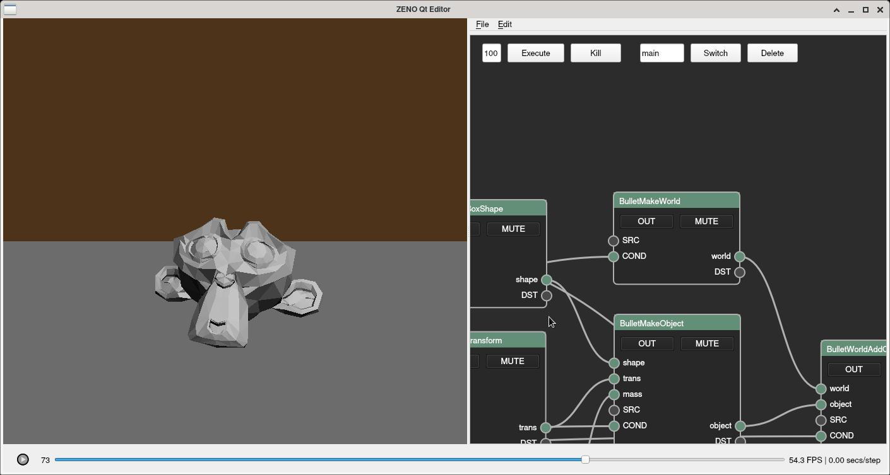
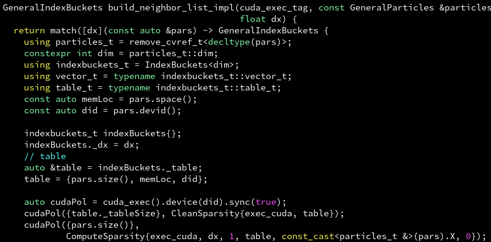
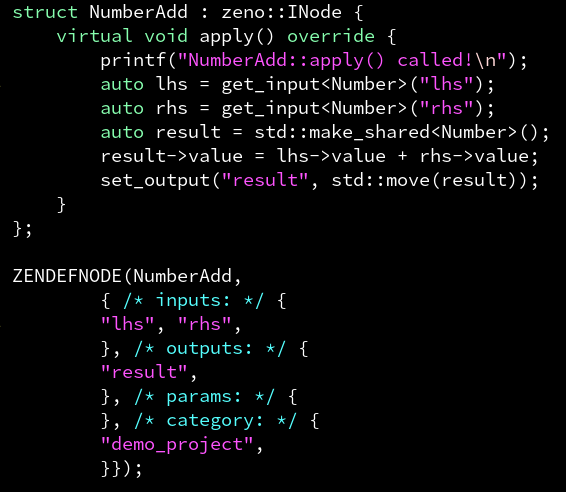
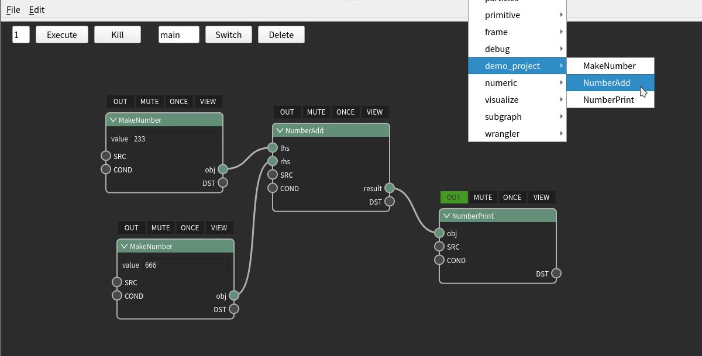
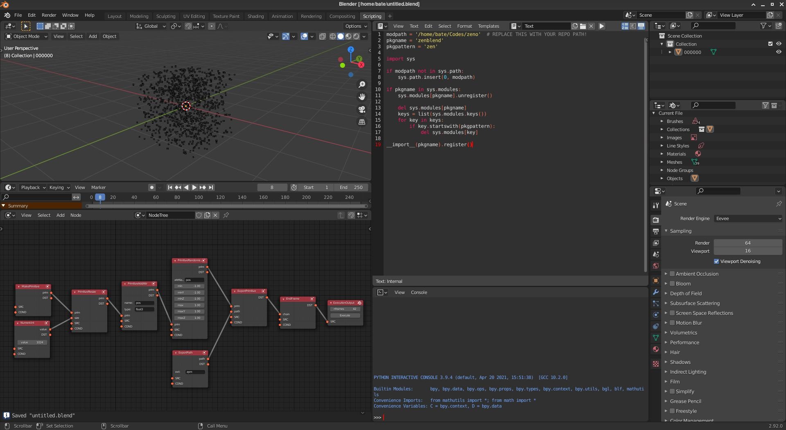

# ZENO

[](https://github.com/zenustech/zeno/actions/workflows/cmake.yml) [](LICENSE) [](https://github.com/zenustech/zeno/releases)

Open-source node system framework, to change your algorithmic code into useful tools to create much more complicated simulations!



ZENO is an OpenSource, Node based 3D system able to produce cinematic physics effects at High Efficiency, it was designed for large scale simulations and has been tested on complex setups.
Aside of its simulation Tools, ZENO provides necessary visualization nodes for users to import and run simulations if you feel that the current software you are using is too slow.


## Features

Integrated Toolbox, from volumetric geometry process tools (OpenVDB), to state-of-art, commercially robust, highly optimized physics solvers and visualization
nodes, and various VFX and simulation solutions based on our nodes (provided by .zsg file in `arts/` folder).

## Gallery


<!--
## ZenCompute (@littlemine)

Open-source code development framework to easily develop high-performance physical simulation code that both run on cpu and gpu with out too much effort. Now intergrated into ZENO.

[](https://github.com/zenustech/zpc)
-->


# Motivation

Nowadays, many CG artists have reached an agreement that creating arts (especially
physics simulation and animation) using visual-programming tool is very convinent and flexible.

This repo aims to provide a great tool for both technical artists and CG developers, and researchers from physics simulation.

## Easy Plug, Easy Go

One may create complicated simulation scenarios by simply connecting the nodes provided by the system. For example, here's a molecular simulation built by our users:


This is the charm of visual-programming, not only the direction of data-flow, but also the logic-flow of the solution algorithm is presented at no more clarity.
In fact, building this molecular simulation from scratch took no more than 7 minutes!

## Flexible

One can easily change or adjust a solution by simply break and reconnect of the nodes.
Unlike many simulation softwares that have fixed functionality, we provide the building
blocks of algorithms in the form of **nodes** at a relatively low granularity.
By connecting these nodes, you can literally create your unique solver that best fits
your need, rather than being limited by the imagination of software programmers.
For example, here @zhxx1987 created two-way coupled fluid-rigid simulation by adding some nodes to pass momentums from surfaces despite the FLIP solver didn't support fluid-rigid coupling at the first place:


## Performant

ZENO nodes are mainly written in C++. By connecting nodes in our Qt5 editor,
you are invoking our highly optimized programs by our senior engineers. And
all you need to do is to explore in your mind-space without bothering to tackle 
low-level details.
Performance-wisely, it's shown by @zhxx1987 that our FLIP solver is 4x faster than
Houdini at large scale.


## Control-flows

Unlike many pure functional node systems (e.g. Blender), ZENO has a strong time-order
and provide a lot of control-flow nodes including CachedOnce, BeginForEach, EndFor, etc.
This enable you to make turing-equivalent programs that fit real-world problems.


## Simplicity

For those many outstanding systems with visual-programming abilities out there,
one may have a hard time integrate new things into those systems, often due to their
tight coupled design of data structures, as well as system archs. 
Zeno adopts a highly decoupled design of things, making extending it becoming super-simple.

Here's an example on how to add a ZENO node with its C++ API:



## Extensible

As a comparison, the ZENO node system is very extensible. Although ZENO itself
doesn't provide any solvers, instead it allows users to **write their own nodes**
using its C++ API.
Here's some of the node libraries that have been implemented by our developers:

- Z{f(x)} expression wrangler (by @archibate)
- basic primitive ops (by @archibate)
- basic OpenVDB ops (by @zhxx1987)
- OpenVDB FLIP fluids (by @zhxx1987 and @ureternalreward)
- Molocular Dynamics (by @victoriacity)
- GPU MPM with CUDA (by @littlemine)
- Bullet3 rigid solver (by @archibate and @zhxx1987)
- Hypersonic air solver (by @Eydcao @zhxx1987)
- MPM Mesher (by @zhxx1987)

Loading these libraries would add corresponding functional nodes into ZENO,
after which you can creating node graphs with them for simulation.
You may also add your own solver nodes to ZENO with this workflow if you'd like.



## Integratable

Not only you can play ZENO in our official Qt5 editor, but also we may install
ZENO as a **Blender addon**! With that, you can enjoy the flexibilty of ZENO
node system and all other powerful tools in Blender. See `Blender addon` section
for more information.




# End-user Installation

## Get binary release

Go to the [release page](https://github.com/zenustech/zeno/releases/), and click Assets -> download `zeno-linux-20xx.x.x.tar.gz`.
Then, extract this archive, and simply run `./start.sh`, then the node editor window will shows up if everything is working well.

## How to play

There are some example graphs in the `./arts/` folder, you may open them in the editor and have fun!
Currently `rigid3.zsg`, `FLIPSolver.zsg`, `prim.zsg`, and `lennardjones.zsg` are confirmed to be functional.
Hint: To run an animation for 100 frames, change the `1` on the top-left of node editor to `100`, then click `Execute`.
Also MMB to drag in the node editor, LMB click on sockets to create connections. MMB drag in the viewport to orbit camera, Shift+MMB to pan camera.

## Bug report

If you find the binary version didn't worked properly or some error message has been thrown on your machine, please let me know by opening an [issue](https://github.com/zenustech/zeno/issues) on GitHub, thanks for you support!


# Developer Build

## Installation requirements

You need a C++17 compiler, CMake 3.12+, and Python 3.6+ to build ZENO; NumPy and PySide2 (Qt for Python) to run ZENO editor.
Other requirements like Pybind11 or GLAD are self-contained and you don't have to worry installing them manually.

- Arch Linux

```bash
sudo pacman -S gcc make cmake python python-pip python-numpy pyside2
```

- Ubuntu 20.04

```bash
sudo apt-get install gcc make cmake python-is-python3 python-dev-is-python3 python3-pip qt5dxcb-plugin

python --version  # make sure Python version >= 3.7
sudo python -m pip install -U pip
sudo python -m pip install numpy PySide2
```

- Windows 10

1. Install Python 3.8 64-bit. IMPORTANT: make sure you **Add Python 3.8 to PATH**! After that rebooting your computer would be the best.
2. Start CMD in **Administrator mode** and type these commands:
```cmd
python -m pip install numpy PySide2
```
(Fun fact: you will be redirected to Microsoft Store if `python` is not added to PATH properly :)
Make sure it starts to downloading and installing successfully without `ERROR` (warnings are OK though).

If you got `ERROR: Could not install packages due to an EnvironmentError: [Errno 13] Permission denied: 'c:\\python38\\Lib\\site-packages\\PySide2\\Qt5\\bin\\d3dcompiler_47.dll''`:
**Quit anti-virus softwares** (e.g. 360), they probably prevent `pip` from copying DLL files.

If you got `ImportError: DLL load failed while importing QtGui`:
Try install [Microsoft Visual C++ Redistributable](https://aka.ms/vs/16/release/vc_redist.x64.exe).

3. Install Visual Studio 2019 Community Edition or later version (for C++17 support in MSVC).


## Build ZENO

- Linux

```bash
cmake -B build
make -C build -j8
```

- Windows

```cmd
cmake -B build
```
Then open ```build/zeno.sln``` in Visual Studio 2019, and **switch to Release mode in build configurations**, then run `Build -> Build All`.

IMPORTANT: In MSVC, Release mode must **always be active** when building ZENO, since MSVC uses different allocators in Release and Debug mode. If a DLL of Release mode and a DLL in Debug mode are linked together in Windows, it will crash when passing STL objects.


### Run ZENO for development

- Linux

```bash
./run.sh
```

- Windows

```cmd
run.bat
```


## ZENO Extensions

ZENO is extensible which means we may write extensions (node libraries) for it.
The source code of all our official extensions are provided in `projects/`.

### Build extensions

For now, official extensions will be built by default when running the
```ALL_BUILD``` target of CMake.

#### ZenVDB & FastFLIP

Note that the extensions: ZenVDB and FastFLIP are **not built by default**.
You can use
```bash
cmake -B build -DEXTENSION_zenvdb:BOOL=ON -DEXTENSION_FastFLIP:BOOL=ON
```
to enable them.

##### Known issues
```diff
- **The FastFLIP solver we know work well with OpenVDB 7.2.3, and have problem with OpenVDB 8.1.**
```

#### GMPM

You need to update git submodules before building @littlemine's GPU MPM.
To do so:
```bash
git submodule update --init --recursive
```
Then:
```bash
cmake -B build -DEXTENSION_gmpm:BOOL=ON
```
to enable it.

#### ZenoFX

You need to turn on two flags to enable ZenoFX build:
```bash
cmake -B build -DZENO_BUILD_ZFX:BOOL=ON -DEXTENSION_ZenoFX:BOOL=ON
```
to enable it.

Use:
```bash
cmake -B build -DZENO_BUILD_ZFX:BOOL=ON -DEXTENSION_ZenoFX:BOOL=ON -DZFX_ENABLE_CUDA:BOOL=ON
```
if you want to enable CUDA support for ZFX.

#### Major dependencies

Building them require some dependencies:

- ZenoFX (ZFX expression wrangler)
  - OpenMP (optional)
  - CUDA driver API (optional)

- Rigid (bullet3 rigid dynamics)
  - OpenMP

- ZMS (molocular dynamics)
  - OpenMP (optional)

- OldZenBASE (deprecated mesh operations)
  - OpenMP (optional)

- ZenVDB (OpenVDB ops and tools)
  - OpenVDB
  - IlmBase
  - TBB
  - OpenMP (optional)

- FastFLIP (OpenVDB FLIP solver)
  - OpenVDB
  - IlmBase
  - Eigen3
  - TBB
  - OpenBLAS
  - ZenVDB (see above)
  - OldZenBASE (see above)
  - OpenMP (optional)

- GMPM (GPU MPM solver)
  - CUDA toolkit
  - OpenVDB (optional)
  - OpenMP (optional)

- Mesher (MPM Meshing)
  - Eigen3
  - OpenMP (optional)

Other extensions are built by default because their dependencies are
self-contained and portable to all platforms.

### Write your own extension!

See ```demo_project/``` for an example on how to write custom nodes in ZENO.

#### Installing extensions

To install a node library for ZENO just copy the `.so` or `.dll` files to `zeno/lib/`. See ```demo_project/CMakeLists.txt``` for how to automate this in CMake.


# Miscellaneous

## Blender addon

Work in progress, may not work, see `assets/blender.blend`. The source code of our blender addon is under `zenblend/`. Contributions are more than welcome!

## Contributors

Thank you to all the people who have already contributed to ZENO!

[](https://github.com/zenustech/zeno/graphs/contributors)

## License

ZENO is licensed under the Mozilla Public License Version 2.0, see [LICENSE](LICENSE) for more information.

## Contact us

You may contact us via WeChat:

* @zhxx1987: shinshinzhang

* @archibate: tanh233


# Maintainers' manual

## Build binary release

- Arch Linux

```bash
./dist.sh
# you will get /tmp/release/zeno-linux-20xx.x.x.tar.gz
```

- Windows

First, download `zenv-windows-prebuilt.zip` from [this page](https://github.com/zenustech/binaries/releases).
Second, extract it directly into project root.
Then run `dist.bat` in project root.
Finally, rename the `zenv` folder to `zeno-windows-20xx.x.x`, and archive it into `zeno-windows-20xx.x.x.zip`.
