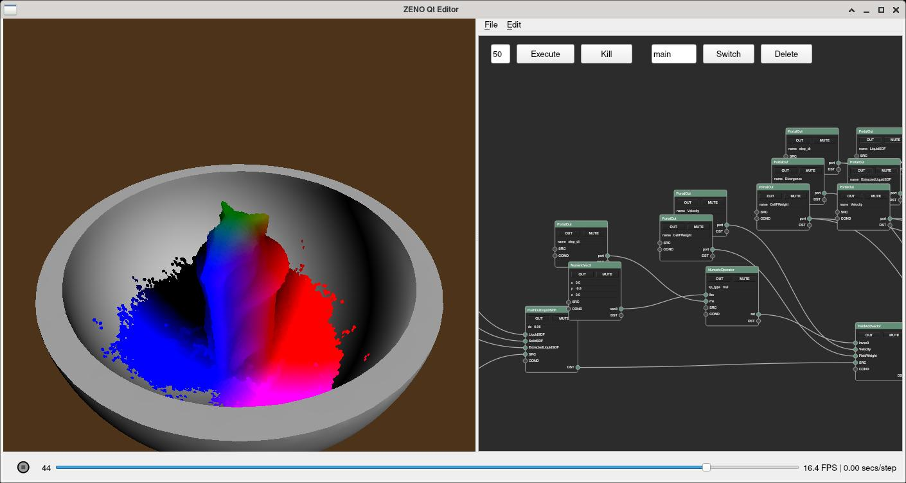
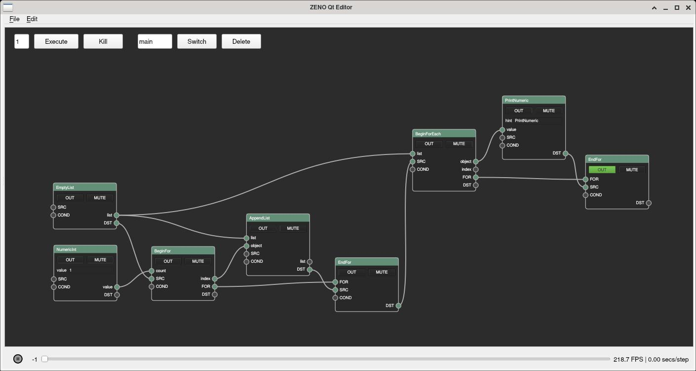
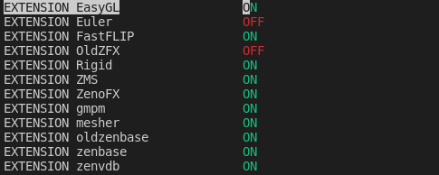
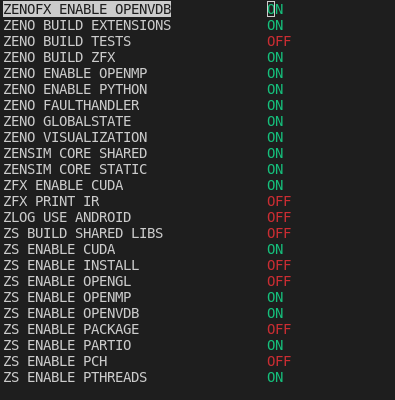

# ZENO

[](https://github.com/zenustech/zeno/actions/workflows/cmake.yml) [](LICENSE) [](https://github.com/zenustech/zeno/releases)

Open-source node system framework, to change your algorithmic code into useful tools to create much more complicated simulations!


ZENO is an OpenSource, Node based 3D system able to produce cinematic physics effects at High Efficiency, it was designed for large scale simulations and has been tested on complex setups.
Aside of its simulation Tools, ZENO provides necessary visualization nodes for users to import and run simulations if you feel that the current software you are using is too slow.


## Features

Integrated Toolbox, from volumetric geometry process tools (OpenVDB), to state-of-art, commercially robust, highly optimized physics solvers and visualization
nodes, and various VFX and simulation solutions based on our nodes (provided by .zsg file in `graphs/` folder).

## Gallery


<!--
## ZenCompute (@littlemine)

Open-source code development framework to easily develop high-performance physical simulation code that both run on cpu and gpu with out too much effort. Now intergrated into ZENO.

[](https://github.com/zenustech/zpc)
-->


# Motivation

Nowadays, many CG artists have reached an agreement that creating arts (especially
physics simulation and animation) using visual-programming tool is very convinent and flexible.

This repo aims to provide a great tool for both technical artists and CG developers, and researchers from physics simulation.

## Easy Plug, Easy Go

One may create complicated simulation scenarios by simply connecting the nodes provided by the system. For example, here's a molecular simulation built by our users:


This is the charm of visual-programming, not only the direction of data-flow, but also the logic-flow of the solution algorithm is presented at no more clarity.
In fact, building this molecular simulation from scratch took no more than 7 minutes!

## Flexible

One can easily change or adjust a solution by simply break and reconnect of the nodes.
Unlike many simulation softwares that have fixed functionality, we provide the building
blocks of algorithms in the form of **nodes** at a relatively low granularity.
By connecting these nodes, you can literally create your unique solver that best fits
your need, rather than being limited by the imagination of software programmers.
For example, here @zhxx1987 created two-way coupled fluid-rigid simulation by adding some nodes to pass momentums from surfaces despite the FLIP solver didn't support fluid-rigid coupling at the first place:


## Performant

ZENO nodes are mainly written in C++. By connecting nodes in our Qt5 editor,
you are invoking our highly optimized programs by our senior engineers. And
all you need to do is to explore in your mind-space without bothering to tackle 
low-level details.
Performance-wisely, it's shown by @zhxx1987 that our FLIP solver is 4x faster than
Houdini at large scale.



## Control-flows

Unlike many pure functional node systems (e.g. Blender), ZENO has a strong time-order
and provide a lot of control-flow nodes including CachedOnce, BeginForEach, EndFor, etc.
This enable you to make turing-equivalent programs that fit real-world problems.



## Simplicity

For those many outstanding systems with visual-programming abilities out there,
one may have a hard time integrate new things into those systems, often due to their
tight coupled design of data structures, as well as system archs. 
Zeno adopts a highly decoupled design of things, making extending it becoming super-simple.

Here's an example on how to add a ZENO node with its C++ API:

[](https://github.com/zenustech/zeno_addon_wizard/blob/main/YourProject/CustomNumber.cpp)

## Extensible

As a comparison, the ZENO node system is very extensible. Although ZENO itself
doesn't provide any solvers, instead it allows users to **write their own nodes**
using its C++ API.
Here's some of the node libraries that have been implemented by our developers:

- Z{f(x)} expression wrangler (by @archibate)
- basic primitive ops (by @archibate)
- basic OpenVDB ops (by @zhxx1987)
- OpenVDB FLIP fluids (by @zhxx1987 and @ureternalreward)
- Molocular Dynamics (by @victoriacity)
- GPU MPM with CUDA (by @littlemine)
- Bullet3 rigid solver (by @archibate and @zhxx1987)
- Hypersonic air solver (by @Eydcao @zhxx1987)
- MPM Mesher (by @zhxx1987)

Loading these libraries would add corresponding functional nodes into ZENO,
after which you can creating node graphs with them for simulation.
You may also add your own solver nodes to ZENO with this workflow if you'd like.


## Integratable

Not only you can play ZENO in our official Qt5 editor, but also we may install
ZENO as a **Blender addon**! With that, you can enjoy the flexibilty of ZENO
node system and all other powerful tools in Blender. See `Blender addon` section
for more information.


# End-user Installation

## Get binary release

Go to the [release page](https://github.com/zenustech/zeno/releases/), and click Assets -> download `zeno-linux-20xx.x.x.tar.gz`.
Then, extract this archive, and simply run `./launcher` (`launcher.exe` for Windows), then the node editor window will shows up if everything is working well.

## How to play

There are some example graphs in the `graphs/` folder, you may open them in the editor and have fun!
Hint: To run an animation for 100 frames, change the `1` on the top-left of node editor to `100`, then click `Execute`.
Also MMB to drag in the node editor, LMB click on sockets to create connections. MMB drag in the viewport to orbit camera, Shift+MMB to pan camera.

## Bug report

If you find the binary version didn't worked properly or some error message has been thrown on your machine, please let me know by opening an [issue](https://github.com/zenustech/zeno/issues) on GitHub, thanks for you support!


# Developer Build

## Installation requirements

You need a C++17 compiler, CMake 3.12+, and Python 3.6+ to build ZENO; Pybind11, NumPy and PySide2 (Qt for Python) to run ZENO editor.
Other requirements like GLAD are self-contained and you don't have to worry installing them manually.

> Hint: for Python, please try avoid using virtualenv and Conda if possible.

### Ubuntu 20.04

```bash
# Install basic dependencies:
sudo apt-get install -y gcc make cmake python-is-python3 python-dev-is-python3 python3-pip qt5dxcb-plugin

python --version  # make sure Python version >= 3.6
sudo python -m pip install -U pip
sudo python -m pip install pybind11 numpy PySide2

# (Optional) for easily altering cmake configurations from terminal:
sudo apt-get install -y cmake-curses-gui

# (Optional) Install Zlib, Eigen3, OpenBLAS:
sudo apt-get install -y zlib1g-dev libeigen3-dev libopenblas-dev

# (Optional) Installing OpenVDB dependencies (Boost, TBB, Blosc, OpenEXR):
sudo apt-get install -y libilmbase-dev libopenexr-dev libtbb-dev
sudo apt-get install -y libboost-iostreams-dev libboost-system-dev

git clone https://github.com/Blosc/c-blosc.git --branch=v1.5.0
cd c-blosc
mkdir build
cd build
cmake ..
make -j8
sudo make install
cd ../..

# (Optional) Install OpenVDB:
git clone https://github.com/AcademySoftwareFoundation/openvdb.git --branch=v7.2.1
cd openvdb
mkdir build
cd build
cmake ..
make -j8
sudo make install
cd ../..
```

See also [`Dockerfile`](Dockerfile) as a reference for full installing steps.

### CentOS 7

```bash
# Install basic dependencies:
sudo yum -y install wget make python3 python3-devel

sudo python3 -m pip install pybind11 numpy PySide2

# Install CMake dependency (OpenSSL):
sudo yum -y install openssl openssl-devel

# Install CMake 3.17:
wget -c https://github.com/Kitware/CMake/releases/download/v3.17.0-rc3/cmake-3.17.0-rc3.tar.gz
tar zxvf cmake-3.17.0-rc3.tar.gz
cd cmake-3.17.0-rc3
./bootstrap
make -j8
sudo make install
cd ..

# Allowing CMake 3.17 to be launched directly from shell:
sudo ln -sf /usr/local/bin/cmake /usr/bin/

cmake --version  # make sure CMake version is 3.17 now

# (Optional) Install Zlib, Eigen3, OpenBLAS:
sudo yum -y install bzip2-devel zlib-devel

git clone https://github.com/eigenteam/eigen-git-mirror.git --branch=3.3.7
cd eigen-git-mirror
mkdir build
cd build
cmake ..
sudo make install
cd ../..

git clone https://github.com/xianyi/OpenBLAS.git --branch=v0.3.17
cd OpenBLAS
make FC=gfortran -j8
sudo make install PREFIX=/usr/local

# Install GCC 9.x
yum -y install centos-release-scl
yum -y install devtoolset-9-gcc
yum -y install devtoolset-9-gcc-c++

# Enable GCC 9.x (must be executed before build)
scl enable devtoolset-9 bash
g++ --version  # Make sure G++ version is 9.x now

# (Optional) Install OpenVDB dependencies (Boost, TBB, Blosc, OpenEXR):
git clone https://github.com/aforsythe/IlmBase.git --branch=v2.0.0
cd IlmBase
mkdir build
cd build
cmake ..
make -j8
sudo make install
cd ../..

git clone https://github.com/AcademySoftwareFoundation/openexr.git --branch=v2.3.0
cd openexr
mkdir build
cd build
cmake .. -DOPENEXR_BUILD_PYTHON_LIBS:BOOL=OFF
make -j8
sudo make install
cd ../..

wget https://cfhcable.dl.sourceforge.net/project/boost/boost/1.67.0/boost_1_67_0.tar.gz
tar zxvf boost_1_67_0.tar.gz
cd boost_1_67_0
./bootstrap.sh
./b2 -j8 --without-python
sudo ./b2 install --without-python

git clone https://github.com/oneapi-src/oneTBB.git --branch=2017_U8
cd oneTBB
make -j8
sudo cp -r include/tbb /usr/local/include/
sudo cp -r build/linux_*_release/*.so* /usr/local/lib64/
sudo cp cmake/*.cmake /usr/local/lib/pkgconfig/
sudo cp -r cmake/templates /usr/local/lib/pkgconfig/
cd ..

git clone https://github.com/Blosc/c-blosc.git --branch=v1.5.0
cd c-blosc
mkdir build
cd build
cmake ..
make -j8
sudo make install
cd ../..

# (Optional) Install OpenVDB:
git clone https://github.com/AcademySoftwareFoundation/openvdb.git --branch=v7.2.1
cd openvdb
mkdir build
cd build
cmake ..
make -j8
sudo make install
cd ../..
```

### Windows 10

1. Install Python 3.8 64-bit. IMPORTANT: make sure you **Add Python 3.8 to PATH**! After that rebooting your computer would be the best.

2. Start CMD in **Administrator mode** and type these commands:
```cmd
python -m pip install pybind11 numpy PySide2
```
(Fun fact: you will be redirected to Microsoft Store if `python` is not added to PATH properly :)
Make sure it starts to downloading and installing successfully without `ERROR` (warnings are OK though).

If you got `ERROR: Could not install packages due to an EnvironmentError: [Errno 13] Permission denied: 'c:\\python38\\Lib\\site-packages\\PySide2\\Qt5\\bin\\d3dcompiler_47.dll''`:
**Quit anti-virus softwares** (e.g. 360), they probably prevent `pip` from copying DLL files.

If you got `ImportError: DLL load failed while importing QtGui`:
Try install [Microsoft Visual C++ Redistributable](https://aka.ms/vs/16/release/vc_redist.x64.exe).

3. Install Visual Studio 2019 Community Edition or later version (for C++17 support in MSVC).

4. (Optional) Install other dependencies via [vcpkg](https://github.com/microsoft/vcpkg):

```cmd
git clone https://github.com/microsoft/vcpkg.git --depth=1
cd vcpkg

@rem (Optional) integrate vcpkg into your VS2019 if necessary:
vcpkg integrate install

@rem (Optional) Install OpenVDB for the extension ZenVDB & FastFLIP:
vcpkg install openvdb:x64-windows

@rem (Optional) Install Eigen3 for the extension FastFLIP:
vcpkg install eigen3:x64-windows
```

Hint: You may need to install the `English Pack` for VS2019, and have fast internet condition for vcpkg to work. See [their official guide](https://github.com/microsoft/vcpkg/blob/master/README_zh_CN.md) for more details.

### Arch Linux

```bash
sudo pacman -S gcc make cmake python python-pip python-numpy pyside2
```

See also [`Dockerfile.archlinux`](Dockerfile.archlinux) for full installing steps.

### Docker

```bash
./docker.sh
```


## Build ZENO

### Linux

```bash
cmake -B build
cmake --build build --parallel
```

> Optional: You can change some cmake configurations using `ccmake`.

```bash
cmake -B build
ccmake -B build  # will shows up a curses screen, c to save, q to exit
```

> Below is the suggested Extension Setup:




> if you have confidence with your GPU and CUDA version, also turn ON those CUDA related stuffs, see figures below: (change mesher, gmpm, ZS_CUDA, ZFXCUDA to OFF may skip cmake and gpu dependencies issue, while disable you from using GPU computing features)


### Windows

```cmd
cmake -B build -DCMAKE_BUILD_TYPE=Release
```
Then open ```build/zeno.sln``` in Visual Studio 2019, and **switch to Release mode in build configurations**, then run `Build -> Build All` (Ctrl+Shift+B).

> Optional: You can change some cmake configurations using `cmake-gui`.

```cmd
cmake -B build
cmake-gui -B build
@rem will shows up a window to allow you turn ON/OFF the extensions build
```

IMPORTANT: In MSVC, **Release** mode must **always be active** when building ZENO, since MSVC uses different allocators in Release and Debug mode. If a DLL of Release mode and a DLL in Debug mode are linked together in Windows, it will crash when passing STL objects.


## Run ZENO for development

```bash
./run.py
```

- Windows
```bash
python run.py
```

After successfully loading the editor, you may click `File -> Open` to play `graphs/LorenzParticleTrail.zsg` to confirm everything is working well :)

## Troubleshooting

If you got:
```bash
This application failed to start because it could not find or load the Qt platform plugin "xxx"

Reinstalling the application may fix this problem.
```

### Windows 10

Are you using Anaconda? Please try using the methods in: https://stackoverflow.com/questions/41994485/how-to-fix-could-not-find-or-load-the-qt-platform-plugin-windows-while-using-m

### Ubuntu 20.04

```bash
sudo apt-get install -y qt5dxcb-plugin
```

Please let me know if you have any trouble not mentioned above by opening an [issue](https://github.com/zenustech/zeno/issues) on GitHub, thanks for you support!

### WSL

WSL doesn't have X11 display by default :( Please try search the Web for how to enable it, sorry!

# Building ZENO Extensions

ZENO is extensible which means we may write extensions (node libraries) for it.
The source code of all our official extensions are provided in `projects/`.

For now, official extensions will be built by default when running the
```ALL_BUILD``` target of CMake.

But some of the extensions are not **enabled by default** because they requries optional dependencies, don't worry, you can enable them with the following commands:

## Building Rigid

```bash
cmake -B build -DEXTENSION_Rigid:BOOL=ON
```

## Building ZenVDB & FastFLIP

```bash
cmake -B build -DEXTENSION_zenvdb:BOOL=ON -DEXTENSION_FastFLIP:BOOL=ON -DZENOFX_ENABLE_OPENVDB:BOOL=ON
```

> **The FastFLIP solver we know work well with OpenVDB 7.2.3, and have problem with OpenVDB 8.1.**

## Building GMPM & Mesher

```bash
# update git submodules to fetch @littlemine's ZPC submodule:
git submodule update --init --recursive
cmake -B build -DEXTENSION_gmpm:BOOL=ON -DEXTENSION_mesher:BOOL=ON
```

## Building Euler

```bash
cmake -B build -DEXTENSION_Euler:BOOL=ON
```

## Major dependencies

Building them require some dependencies:

- ZenoFX (ZFX expression wrangler)
  - OpenMP (optional)
  - OpenVDB (optional)

- Rigid (bullet3 rigid dynamics)
  - OpenMP

- ZMS (molocular dynamics)
  - OpenMP (optional)

- OldZenBASE (deprecated mesh operations)
  - OpenMP (optional)

- ZenVDB (OpenVDB ops and tools)
  - OpenVDB
  - IlmBase
  - TBB
  - OpenMP (optional)

- FastFLIP (OpenVDB FLIP solver)
  - OpenVDB
  - IlmBase
  - Eigen3
  - TBB
  - OpenBLAS
  - ZenVDB (see above)
  - OldZenBASE (see above)
  - OpenMP (optional)

- GMPM (GPU MPM solver)
  - CUDA toolkit
  - OpenVDB (optional)
  - OpenMP (optional)

- Mesher (MPM Meshing)
  - Eigen3
  - OpenMP (optional)

- Euler (aerodynamics solver)
  - OpenVDB
  - IlmBase
  - Eigen3
  - TBB
  - ZenVDB (see above)
  - OldZenBASE (see above)


Other extensions are built by default because their dependencies are
self-contained and portable to all platforms.

## Write your own extension!

See https://github.com/zenustech/zeno_addon_wizard for an example on how to write custom nodes in ZENO.


# Miscellaneous

## Blender addon

Work in progress, may not work, see `assets/blender.blend`. The source code of our blender addon is under `zenblend/`. Contributions are more than welcome!

## Contributors

Thank you to all the people who have already contributed to ZENO!

[](https://github.com/zenustech/zeno/graphs/contributors)

## License

ZENO is licensed under the Mozilla Public License Version 2.0, see [LICENSE](LICENSE) for more information.

## Contact us

You may contact us via WeChat:

* @zhxx1987: shinshinzhang

* @archibate: tanh233


# Maintainers' manual

## Run intergrated test

### Linux

```bash
cmake -B build -DZENO_BUILD_TESTS:BOOL=ON
cmake --build build --parallel
build/tests/zentest
```

### Windows

```cmd
cmake -B build -DZENO_BUILD_TESTS:BOOL=ON
cmake --build build --parallel
build\tests\zentest.exe
```

## Build binary release

- Linux
```bash
./dist.py
```

- Windows
```bash
python dist.py
```

You will get dist/launcher.zip, upload it to, for example, zeno-linux-2021.8.7.zip in the `Release` page.

## Build binary release (old method)

### Arch Linux

```bash
scripts/dist.sh
# you will get /tmp/release/zeno-linux-20xx.x.x.tar.gz
```

### Windows

First, download `zenv-windows-prebuilt.zip` from [this page](https://github.com/zenustech/binaries/releases).
Second, extract it directly into project root.
Then run `scripts/dist.bat` in project root.
Finally, rename the `zenv` folder to `zeno-windows-20xx.x.x`, and archive it into `zeno-windows-20xx.x.x.zip`.
